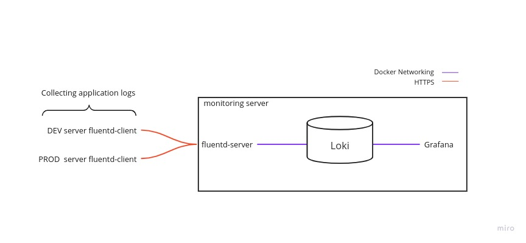
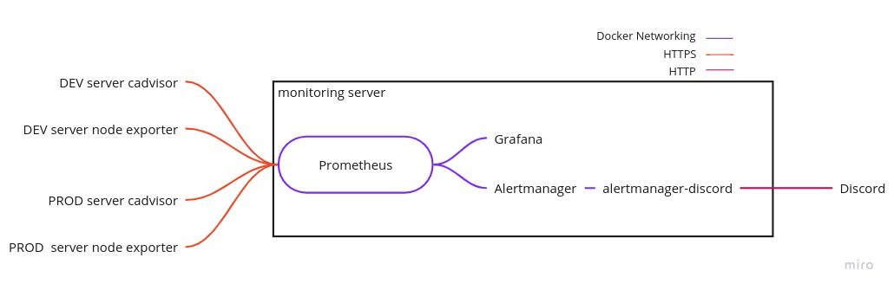

# Monitoring

Collecting logs and metrics for hypothetical DEV and PROD servers. Opening up a new machine we'll call the monitoring server to host Prometheus, Fluentd, Loki and Grafana.

## Logs

## Metrics

## TO-DO

- Better documentation.
- Service discovery.

